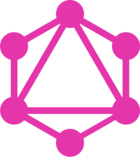
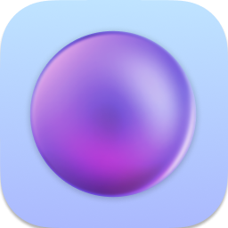
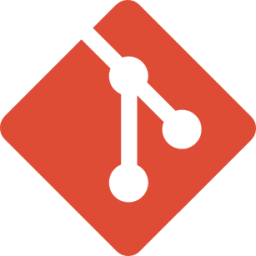
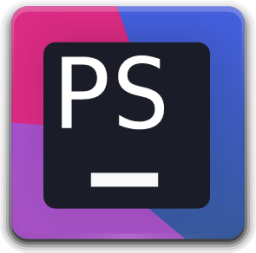
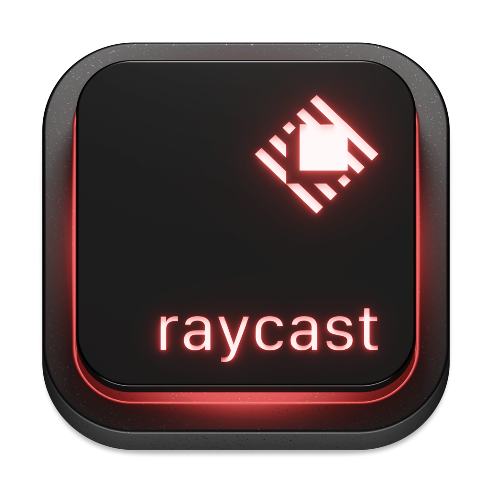
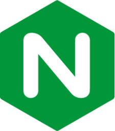
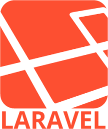

# 👋 Hello, I'm Aaron!
I'm a Senior Engineering Manager who still finds plenty of time to code. Most of my history has been in backend engineering, leveraging PHP and MySQL, but I try to continue to learn new technology regularly.

 

## 💬 My languages

    
    
    

## 🧰 My tools

    
    
    
    
    
    
    

## 🖥️ My Tech

    
    
    
    

## 🏭 My Frameworks

    
    

## 💾 My OSes

    
    
    
    

## 🧑‍🎓 Learning

    
    
    

